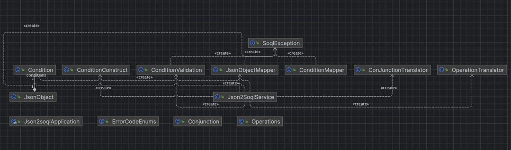

# Programming Test Q&A

Write a program to implement converting JSON input as SOQL.
The input JSON has the following structure:

```json
{
"conditions": [
{
"field": <String>,
"operator": <String>,
"values": [<String>]
},
...
],
"conjunction": <String>
}
```
 The output SOQL should have the following structure:

```sql
(<field> <operator> <value>) <conjunction> (<field> <operator> <value>) <conjunction> ...
```

### <font color="lightgreen">Q1. Where <field> is the field attribute from the input JSON, <operator> is the operator attribute from the input JSON, <value> is the first element from the values array in the input JSON, and <conjunction> is either "AND" or "OR" depending on the conjunction attribute in the input JSON.</font>
[Example Input 1](#example1)

### <font color="#00bfff"> A1：
[Json2SoqlService.java](src%2Fmain%2Fjava%2Fcom%2Faaron%2Fjson2soql%2Fservices%2FJson2SoqlService.java) <br>
Solution method1: normalJson2Soql(String originJson) <br>
Solution method2: recursiveJson2Soql(JSONObject jsonObject) <br>
Test case: [Json2soqlApplicationTests.java](src%2Ftest%2Fjava%2Fcom%2Faaron%2Fjson2soql%2FJson2soqlApplicationTests.java)<br>
Result:[normalJson2Soql.sql](src%2Fmain%2Fresources%2FnormalJson2Soql.sql)<br></font>

### <font color="lightgreen">Q2. If the operator attribute is "like", "notLike", "equals", "notEquals", "lessThan", "lessThanOrEqualTo", "greaterThan", or "greaterThanOrEqualTo", then the corresponding SOQL operator should be used in the output. If the operator attribute is not one of the supported operators, then the program should exit with an error message.</font>
### <font color="#00bfff">A2: Validate and Throw Exception when failure
[ConditionValidation.java](src%2Fmain%2Fjava%2Fcom%2Faaron%2Fjson2soql%2Fvalidation%2FConditionValidation.java) <br>
[ErrorCodeEnums.java](src%2Fmain%2Fjava%2Fcom%2Faaron%2Fjson2soql%2Fenums%2FErrorCodeEnums.java)<br>
[SoqlException.java](src%2Fmain%2Fjava%2Fcom%2Faaron%2Fjson2soql%2Fexception%2FSoqlException.java)<br>
...</font>

### <font color="lightgreen"><Q3. If a values array has more than one element, then the program should exit with an error message.</font>
### <font color="#00bfff">A3: Validate and Throw Exception when failure
[ConditionValidation.java](src%2Fmain%2Fjava%2Fcom%2Faaron%2Fjson2soql%2Fvalidation%2FConditionValidation.java)<br>
[ErrorCodeEnums.java](src%2Fmain%2Fjava%2Fcom%2Faaron%2Fjson2soql%2Fenums%2FErrorCodeEnums.java)<br>
[SoqlException.java](src%2Fmain%2Fjava%2Fcom%2Faaron%2Fjson2soql%2Fexception%2FSoqlException.java)<br>
...</font>

### <font color="lightgreen">Q4. If the input JSON has nested conditions, then the program should recursively process them as well.
[Example Input 2](#example2)</font>
### <font color="#00bfff"> A4: [Json2SoqlService.java](src%2Fmain%2Fjava%2Fcom%2Faaron%2Fjson2soql%2Fservices%2FJson2SoqlService.java) 
Solution method: recursiveJson2Soql(JSONObject jsonObject)<br>
Test case: [Json2soqlApplicationTests.java](src%2Ftest%2Fjava%2Fcom%2Faaron%2Fjson2soql%2FJson2soqlApplicationTests.java)<br>
Result: [recursiveJson2Soql.sql](src%2Fmain%2Fresources%2FrecursiveJson2Soql.sql)</font>
## <a id="example1">Example Input 1:</a>
````json
{
"conditions" : [
{
"field" : "Country_vod__c",
"operator" : "notLike",
"values" : [ "'%a%'" ]
},
{
"field" : "Account_vod__r.Name",
"operator" : "like",
"values" : [ "'%b%'" ]
},
{
"field" : "QA_Field_04__c",
"operator" : "greaterThanOrEqualTo",
"values" : [ "2020-09-18T16:00:00.000Z" ]
},
{
"field" : "QA_Field_02__c",
"operator" : "equals",
"values" : [ "CNY1" ]
}
],
"conjunction" : "and"
}
````
## Example Output 1: 
````sql
(NOT Country_vod__c like '%a%') AND Account_vod__r.Name like '%b%' AND QA_Field_04__c >= 2020-09-18T16:00:00.000Z AND QA_Field_02__c = CNY1
````
## <a id="example2">Example Input 2:</a>
````json
{
"conditions" : [
{
"conditions" : [
{
"conditions" : [
{
"conditions" : [
{
"field" : "Country_vod__c",
"operator" : "like",
"values" : [ "'%a%'" ]
},
{
"field" : "Email_vod__c",
"operator" : "notLike",
"values" : [ "'%b%'" ]
}
],
"conjunction" : "and"
},
{
"conditions" : [
{
"field" : "City_vod__c",
"operator" : "equals",
"values" : [ "'c'" ]
},
{
"field" : "Name",
"operator" : "notEquals",
"values" : [ "'d'" ]
}
],
"conjunction" : "and"
}
],
"conjunction" : "or"
},
{
"field" : "Address_Line_1_vod__c",
"operator" : "lessThan",
"values" : [ "'e'" ]
}
],
"conjunction" : "and"
},
{
"conditions" : [
{
"field" : "Address_Line_1_vod__c",
"operator" : "greaterThan",
"values" : [ "'f'" ]
},
{
"field" : "Address_Line_2_vod__c",
"operator" : "lessThanOrEqualTo",
"values" : [ "'g'" ]
}
],
"conjunction" : "and"
},
{
"conditions" : [
{
"field" : "Call2_vod__r.Name",
"operator" : "greaterThanOrEqualTo",
"values" : [ "'h'" ]
},
{
"field" : "City_vod__c",
"operator" : "like",
"values" : [ "'i%'" ]
}
],
"conjunction" : "and"
}
],
"conjunction" : "or"
}
````
## Example Output 2:
```sql
(((Country_vod__c like '%a%' AND (NOT Email_vod__c like '%b%')) OR (City_vod__c = 'c' AND Name != 'd')) AND Address_Line_1_vod__c < 'e') OR (Address_Line_1_vod__c > 'f' AND Address_Line_2_vod__c <= 'g') OR (Call2_vod__r.Name >= 'h' AND City_vod__c like 'i%') 
```

